

    
     
     Screenshots - Project Progress 

### __Step 1__
Basic homepage with a bottom navigation bar that allows to switch between different fragments and design of the login fragment.

     
    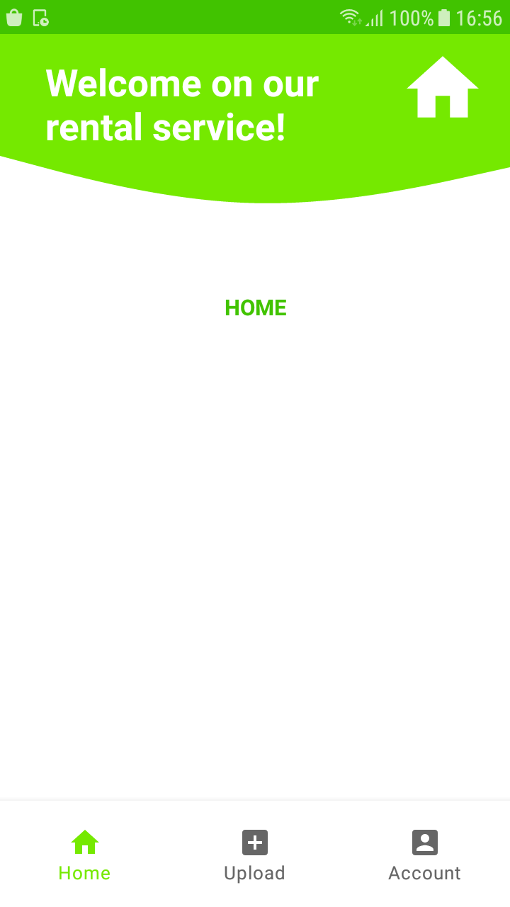
    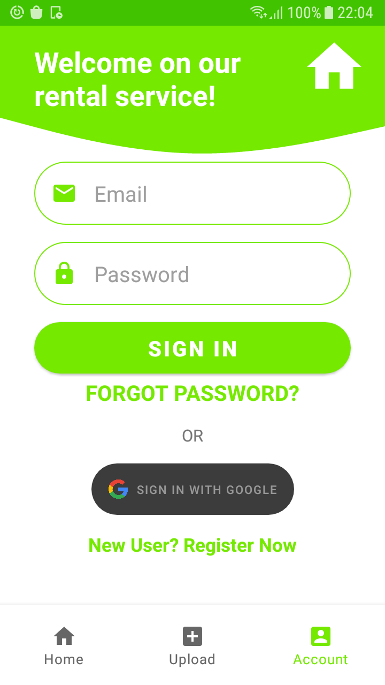
     

### __Step 2__
Firebase Realtime Database implementation. Store data and load it into a ListView.

     
    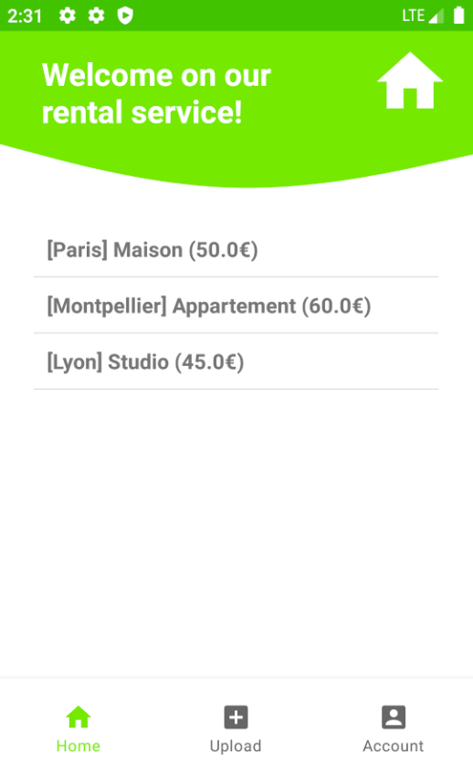
    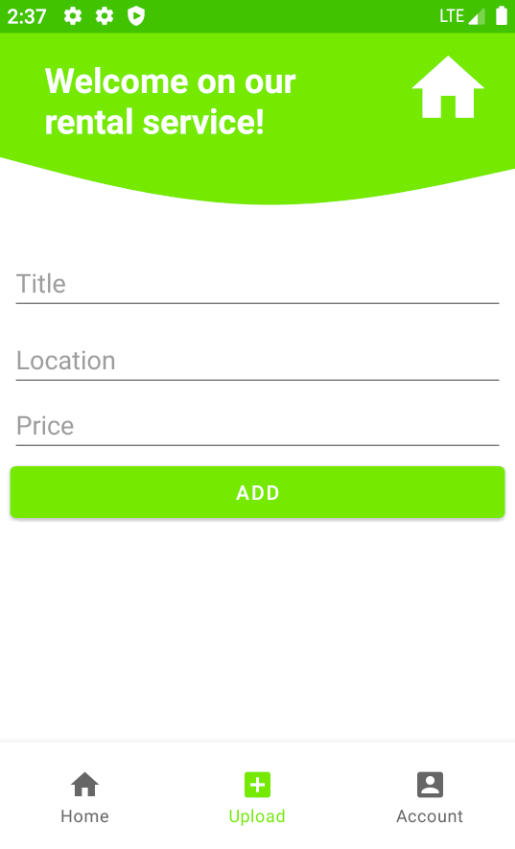
     

### __Step 3__
Final app

     
    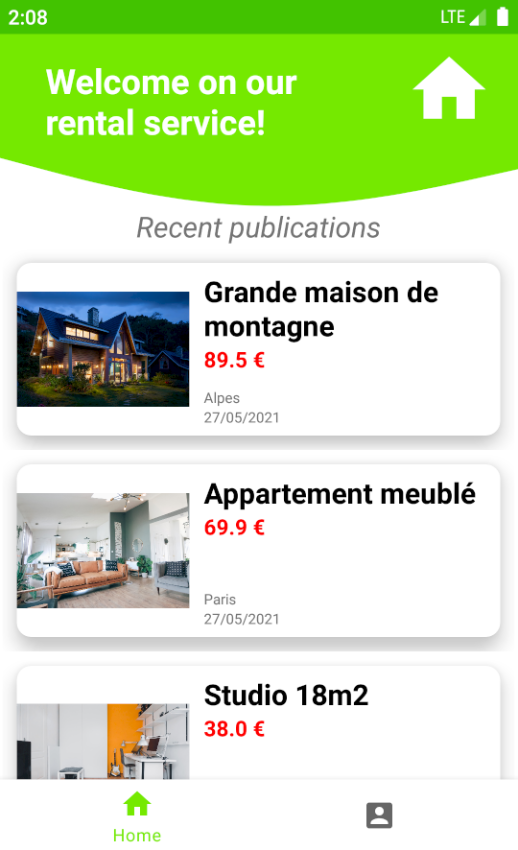
    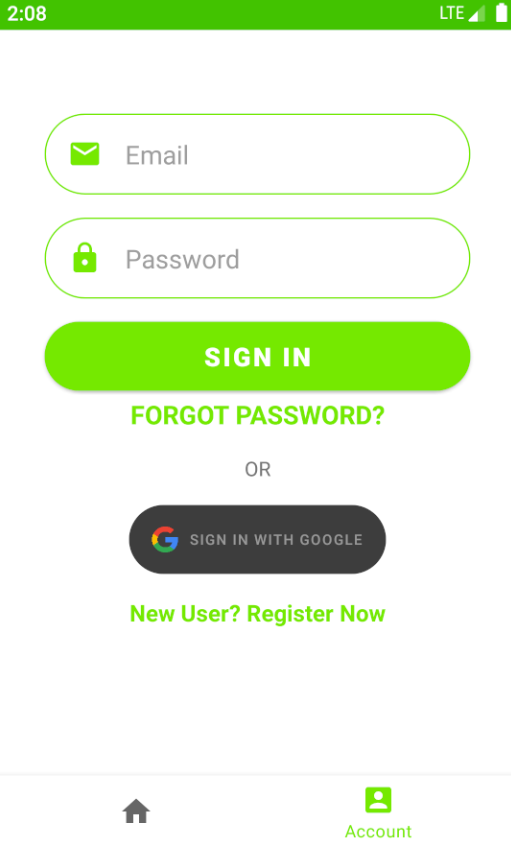
    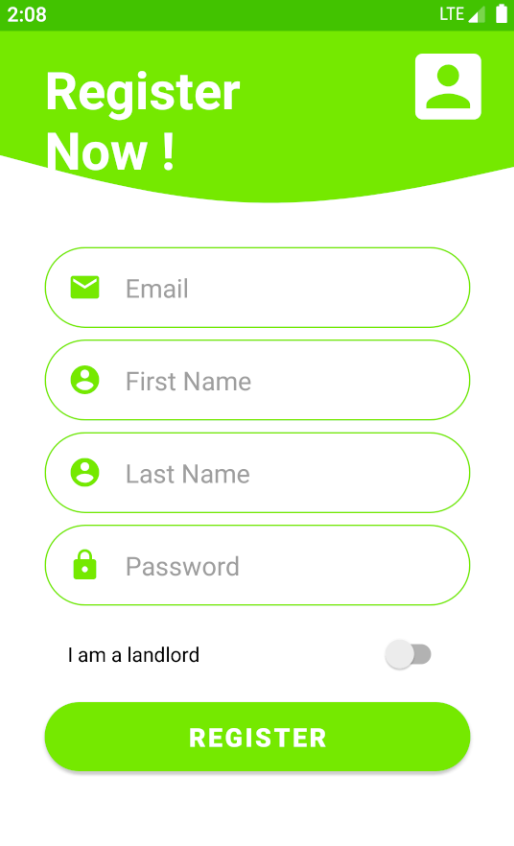
     
    <u>Non logged user</u>

     
    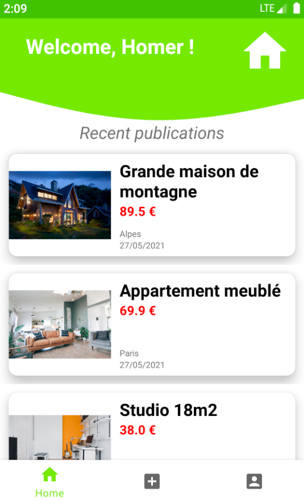
    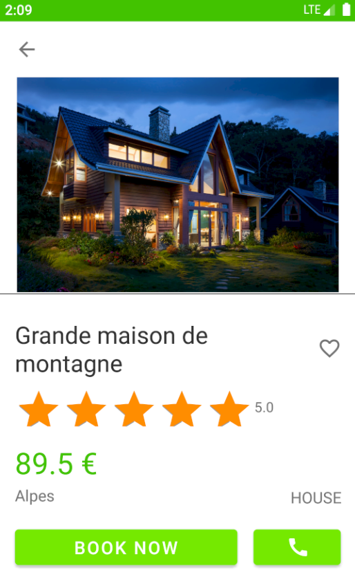
    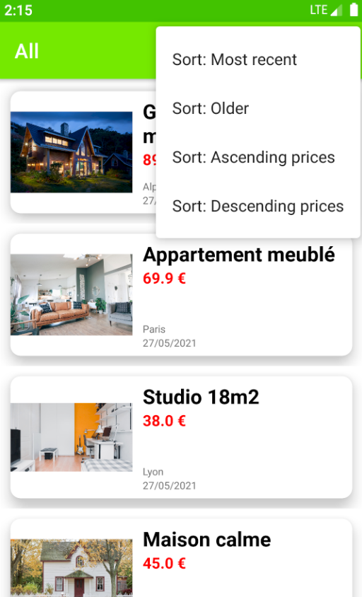
     
    <u>Home / Ad / All ads</u>

 

     
    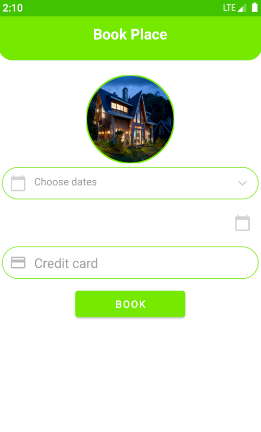
    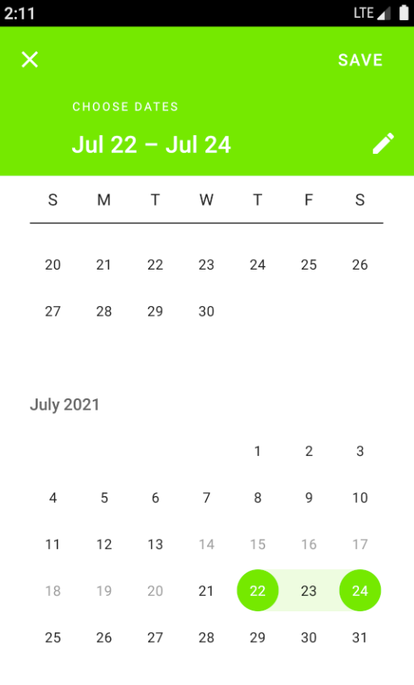
    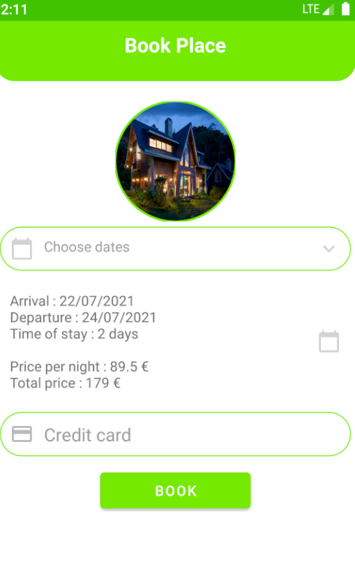
     
    <u>Book / Calendar (with constraint) / Book filled</u>

     
    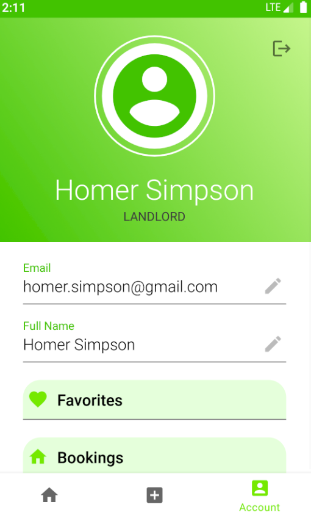
    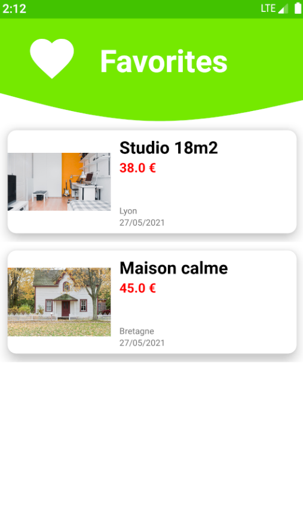
    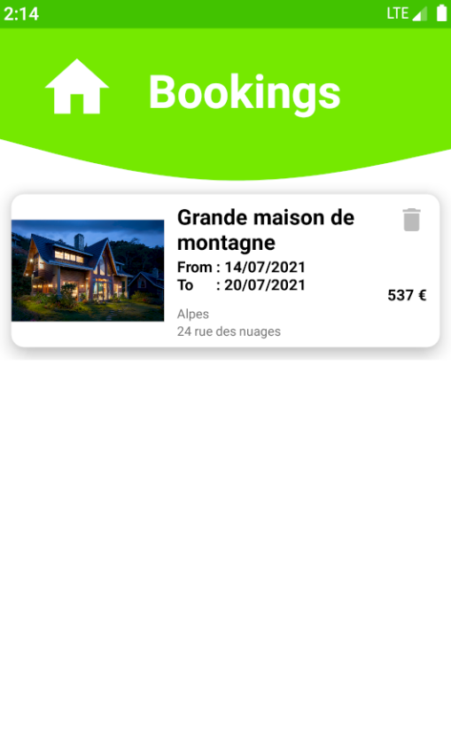
     
    <u>Profile / Favorites / Bookings</u>

     
    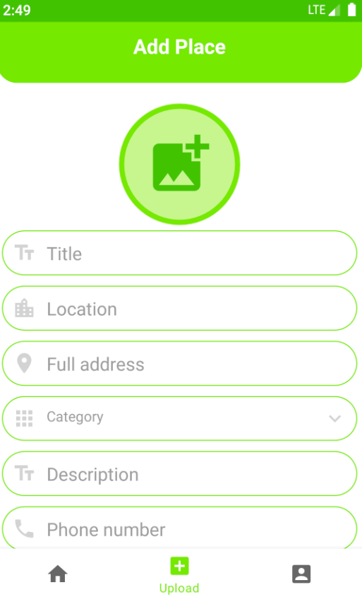
     
    <u>Upload form</u>

